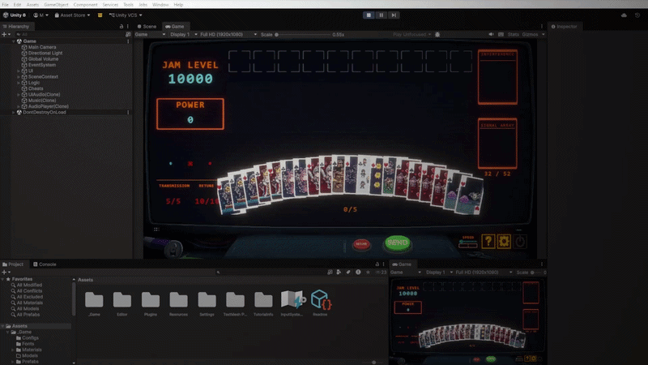

# Unity Fullscreen Game View

> Open Unity's Game View in true fullscreen mode - topmost, taskbar hidden, single hotkey. Test your game exactly as it appears in a build, without leaving the editor.



## Why?

Unity's built-in "Maximize on Play" doesn't actually go fullscreen - the taskbar, window borders, and editor chrome stay visible. This tool fixes that with a single editor script.

## Features

- ✅ True fullscreen Game View (topmost window, above all others)
- ✅ Automatically hides the Windows taskbar
- ✅ Toggle on/off with `Ctrl + Shift + Alt + X`
- ✅ Auto-restores taskbar on editor quit or recompile
- ✅ Single file, zero dependencies
- ✅ MIT licensed - use in commercial projects

## Installation

### Option 1: Manual (recommended)
1. Download [`FullscreenGameView.cs`](Assets/Editor/FullscreenGameView.cs)
2. Place it inside any `Editor/` folder in your Unity project
3. Wait for Unity to compile

### Option 2: Clone the repo
```bash
git clone https://github.com/AO-85/unity-fullscreen-game-view.git
```
Then copy `Assets/Editor/FullscreenGameView.cs` into your project.

## Usage

Enter Play Mode, then:

- **Hotkey:** `Ctrl + Shift + Alt + X`
- **Menu:** `Window → Toggle Fullscreen Game View`

Press once to enter fullscreen, press again to exit.

## Requirements

- Unity 2020.3 LTS or newer (tested on Unity 6)
- Windows 10 / 11 for taskbar hiding (uses `user32.dll`)
- Fullscreen view itself works on macOS/Linux, but taskbar API calls are Windows-only

## How it works

Uses reflection to instantiate Unity's internal `UnityEditor.GameView` as a borderless popup, then calls Win32 `SetWindowPos` with `HWND_TOPMOST` to keep it above the taskbar and all other windows.

## License

[MIT](LICENSE) - free for personal and commercial use.

## Keywords

unity, unity3d, unity editor, fullscreen, game view, editor tool, unity tool, gamedev, c#, indie dev
