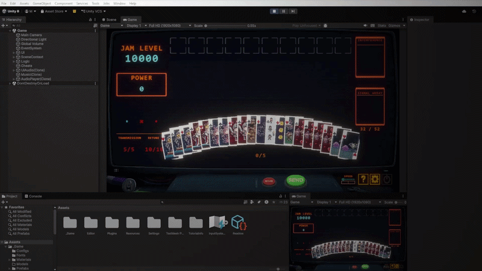

# Unity Fullscreen Game View

> Open Unity Game View in true fullscreen on the monitor your mouse is on, pinned above everything, taskbar hidden. One key. Test your game exactly as it looks in a build, without leaving the editor.



## Why?

Unity's built-in "Maximize on Play" doesn't actually go fullscreen the taskbar stays visible, the Game View toolbar is still there, and you're still looking at your game inside a window. This is a single editor script that fixes that.

## Features

- ✅ True fullscreen Game View borderless, no toolbar, pinned above all other windows
- ✅ Opens on the monitor your mouse cursor is on, not always monitor 1
- ✅ Hides the Windows taskbar, including secondary taskbars on multi-monitor setups
- ✅ F11 by default rebindable in Edit → Shortcuts like any other Unity shortcut
- ✅ Survives script recompiles, and restores the taskbar even if the editor crashes
- ✅ Single file, zero dependencies

## Installation

### Option 1: Manual (recommended)
1. Download [`FullscreenGameView.cs`](Assets/Editor/FullscreenGameView.cs)
2. Place it inside any `Editor/` folder in your Unity project
3. Wait for Unity to compile

### Option 2: Clone the repo
```bash
git clone https://github.com/AO-85/unity-fullscreen-game-view.git
```
Then copy `Assets/Editor/FullscreenGameView.cs` into your project.

## Usage

Enter Play Mode, then:

- **Hotkey:** `F11`
- **Menu:** `Window → Toggle Fullscreen Game View`

Press once to go fullscreen, press again to come back. Works in both Play Mode and Edit Mode.

## Requirements

- Unity 2020.3 LTS or newer (tested on Unity 6)
- Windows 10 / 11 for taskbar hiding (uses `user32.dll`)
- Fullscreen view itself works on macOS/Linux, but taskbar API calls are Windows-only

## How it works

Uses reflection to instantiate Unity's internal `UnityEditor.GameView` as a borderless popup, then calls Win32 `SetWindowPos` with `HWND_TOPMOST` to keep it above the taskbar and all other windows.

## Support

If this tool saved you time, consider buying me a coffee ☕

[](https://ko-fi.com/ao85)

## License

[MIT](LICENSE) - free for personal and commercial use.

## Keywords

unity, unity3d, unity editor, fullscreen, game view, editor tool, unity tool, gamedev, c#, indie dev
